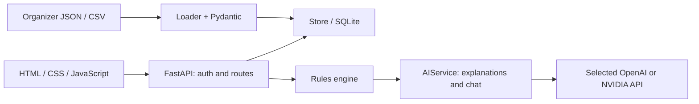

# Career Quest

**AI-навигатор развития сотрудников · Қызметкерлердің дамуына арналған AI-навигатор · AI employee development navigator**

Прототип / Прототип / Prototype: **HackAlem AI — Halyk Bank track**.

[Русский](#ru) · [Қазақша](#kk) · [English](#en) · [Архитектура / Архитектура / Architecture](#architecture) · [Импорт / Импорт / Import](#import)

<a id="ru"></a>

## Русский

### 1. Название и назначение

**Career Quest** помогает сотруднику связать обучение с карьерной целью: увидеть дефициты навыков, выбрать подходящую активность и понять её ожидаемый эффект. HR получает общую картину развития команды и участия в мероприятиях. Это прототип хакатона на синтетических данных, а не действующая кадровая система Halyk Bank.

### 2. Что реализовано

- Вход сотрудником и HR. Сотрудник видит только свой профиль; HR — сводку, профили и импорт.
- Профиль с ролью, грейдом, историей, текущими и требуемыми уровнями навыков; выбор и сохранение карьерной цели из справочника.
- До трёх допустимых рекомендаций с критическими разрывами, ожидаемым изменением навыков и покрытия требований. Если подходящих шагов нет, сервер объясняет причину.
- AI-объяснения и свободный вопрос в «Карьерном помощнике»: «Спросить», Ctrl+Enter и три быстрых вопроса. При недоступности AI есть ответ по правилам сервера с отметкой `fallback`.
- «Выполнить — демо»: симуляция завершения активности, обновление навыков и истории. `Idempotency-Key` защищает повтор запроса от повторного начисления; SQLite сохраняет результат.
- HR-сводка: частые и критические дефициты, сотрудники без следующего шага, участие по мероприятиям и сотрудникам.
- Импорт исходных JSON-профилей и CSV-истории. Одинаковые записи пропускаются; конфликт отклоняет весь импорт без частичного сохранения.

### 3. Как работает решение

1. Адаптер читает профили, каталог навыков, требования к ролям, мероприятия и историю. Pydantic проверяет данные и ссылки.
2. Сервер восстанавливает навыки после последней оценки. Учитываются только `completed` строго после `last_review_date` и не позже даты симуляции, в хронологическом порядке. Отсутствующий навык равен 0.
3. Для цели рассчитываются разрывы и покрытие требований. Если цель не выбрана, система может предложить следующий грейд текущей роли.
4. Алгоритм исключает обязательные и недоступные мероприятия, проверяет текущую роль, грейд, prerequisites, сессии и историю. Критические разрывы имеют двойной вес; история активностей с пересекающимися навыками корректирует оценку в пределах ±10%. Выбираются до трёх лучших шагов.
5. AI объясняет рассчитанные рекомендации и отвечает на вопросы по контексту сотрудника. **Допуск, ранжирование, навыки и проценты рассчитывает backend, а не LLM.**
6. После демовыполнения SQLite сохраняет результат; интерфейс заново получает профиль и рекомендации.

```text
новый уровень = max(текущий, min(текущий + gain, max_level))
покрытие = 100 × Σ min(уровень навыка, требование) / Σ требований
```

Покрытие требований не является вероятностью повышения. Рост навыка вне требований цели может не менять процент. В исходном каталоге повторяемо только `EV_036`; завершение своего начатого участия не требует будущей сессии.

### 4. Технологии

**Python, FastAPI, Uvicorn, Pydantic, SQLite** (`sqlite3`); **HTML, CSS, JavaScript ES modules** без npm-сборки. **HTTPX** выполняет AI-запросы, **python-dotenv** загружает `.env`. Тесты: **pytest**, FastAPI TestClient и Node.js. Версии закреплены в [requirements.txt](requirements.txt) и [requirements-dev.txt](requirements-dev.txt).

В `.env.example` выбран **OpenAI / `gpt-4o-mini`**, Chat Completions API. Код также поддерживает **NVIDIA / `meta/llama-3.3-70b-instruct`** как альтернативу. Вызывается один выбранный провайдер; доступность модели зависит от API и аккаунта. Наличие реализации не означает, что обе интеграции проверены на любом аккаунте.

### 5. Архитектура

Один FastAPI-сервер раздаёт страницу и `/assets`, проверяет права, читает актуальный `Store.snapshot()`, запускает расчёты и AIService. SQLite хранит JSON-снимок состояния и результаты идемпотентных запросов. Модель не получает прямого доступа к БД и не меняет состояние. [Схема и карта файлов](#architecture).

### 6. Установка и запуск

Нужны **Python 3.11+**, современный браузер, интернет для установки зависимостей. **Node.js 22+** нужен только для frontend-тестов. Основные расчёты работают без AI-ключа; для модели нужны серверный ключ и доступ к API.

Откройте PowerShell **в каталоге с `requirements.txt` и `start-career-quest.cmd`**. В архиве он может быть вложенным.

```powershell
python -m venv .venv
.\.venv\Scripts\python.exe -m pip install -r requirements-dev.txt
if (!(Test-Path .env)) { Copy-Item .env.example .env }
```

Для реального AI заполните локальный `.env`:

```dotenv
CAREER_QUEST_AI_PROVIDER=openai
CAREER_QUEST_AI_MODEL=gpt-4o-mini
OPENAI_API_KEY=
```

Впишите ключ после `OPENAI_API_KEY=` только в локальном файле. `.env` автоматически загружается и исключён из Git; переменные процесса имеют приоритет. NVIDIA-ключ при выборе OpenAI не нужен. Для NVIDIA задайте провайдера `nvidia`, совместимую `CAREER_QUEST_AI_MODEL` и `NVIDIA_API_KEY`. После изменения настроек перезапустите сервер.

Демонстрация для жюри:

```powershell
$env:CAREER_QUEST_JURY_DEMO="true"
.\start-career-quest.cmd
```

Откройте [http://127.0.0.1:8000/](http://127.0.0.1:8000/). Дождитесь `Application startup complete` и оставьте терминал открытым. Ctrl+C останавливает сервер. Frontend и backend запускаются одной командой. Если порт 8000 занят, launcher сообщает об ошибке и не завершает чужие процессы.

**Обычный режим:** `CAREER_QUEST_JURY_DEMO=false`, а `CAREER_QUEST_TOKENS` в серверном `.env` — JSON-словарь кодов доступа и ролей. Замените обе заглушки своими кодами:

```dotenv
CAREER_QUEST_TOKENS='{"replace-employee-code":{"role":"employee","employee_id":"E0001"},"replace-hr-code":{"role":"hr"}}'
```

Код доступа Career Quest — **не AI-ключ**. Карточка входа не выдаёт права: роль определяет сервер. При пустом словаре и выключенном деморежиме войти нельзя. Режим жюри выключен по умолчанию и предназначен только для локальной демонстрации синтетических данных. [macOS/Linux и настройки](#configuration).

### 7. Как проверить решение

1. В режиме жюри выберите, например, `E0001`, нажмите «Войти как сотрудник».
2. Посмотрите цель, навыки, критические разрывы и прогноз рекомендаций. Ранее изменённые профили могут давать другие результаты.
3. Спросите помощника: «Какие навыки мне важнее развить для моей цели?» Используйте «Спросить» или Ctrl+Enter; проверьте источник `ai` либо `fallback`.
4. Нажмите «Выполнить — демо» у доступного шага. Проверьте историю и покрытие, затем перезагрузите страницу.
5. Выйдите и войдите как HR. Просмотрите дефициты, участие по мероприятиям и откройте сотрудника.
6. Загрузите JSON и CSV из [примера импорта](#import), откройте `JURY_001`, проверьте историю и рекомендации. Повтор тех же файлов не должен добавлять записи. Изменение данных под прежним ID должно вызвать конфликт.
7. Перезапустите сервер и войдите снова: прогресс, цели и импорт сохраняются; сессия входа создаётся заново.

```powershell
.\.venv\Scripts\python.exe -m pytest -q tests
node tests/frontend.test.mjs
```

Тесты покрывают расчёты, загрузку, авторизацию, импорт и откат, повторные/конкурентные запросы, сохранение, чат, таймауты и некорректные AI-ответы. Frontend-тесты используют имитацию DOM и **не заменяют браузерную проверку**. Python-регрессии отключают реальные ключи провайдеров. Отдельная проверка AI делает один реальный запрос и может расходовать квоту:

```powershell
.\.venv\Scripts\python.exe scripts/check_ai.py
```

### 8. Данные и интеграции

В [data/organizer](data/organizer): `employees.json` — **200 сотрудников**, `events.json` — **40 мероприятий**, `skills.json` — **60 навыков**, `activity_history.csv` — **2743 записи**, включая `overdue`. Данные синтетические. Дата симуляции — **2026-10-01**. Это размеры исходного набора; импорт увеличивает рабочую БД.

По умолчанию состояние хранится в `data/organizer.sqlite3`; исходные JSON/CSV не изменяются. `demo/dataset.json` — отдельный малый набор для тестов и примеров. При смене seed используйте новый `CAREER_QUEST_DB`: несовпадение seed с существующей БД блокирует запуск.

Внешние AI API вызываются сервером. Контекст содержит факты текущего профиля и рекомендации без полей имени и `employee_id`; в чате известные идентификаторы и ключи дополнительно маскируются. Логотип хранится локально в `frontend/halyk-logo.svg`. Интеграции с рабочими банковскими системами, HRIS и LMS не реализованы.

### 9. Ограничения

- Выполнение — симуляция без подтверждения курса или экзамена. Публичных рейтингов, наград и внутренней валюты нет.
- Авторизация упрощённая: без SSO и управления аккаунтами. HttpOnly/SameSite-сессии живут до 8 часов в памяти одного процесса и теряются при перезапуске. Для cookie-запросов на изменение проверяется Origin. Для удалённого размещения нужен HTTPS.
- SQLite хранит единый снимок; промышленная масштабируемость не подтверждена. Импорт — до 1000 профилей и 10000 записей истории, в пределах 2 МиБ на изменяющий запрос. Отличающиеся существующие профили не перезаписываются.
- AI-вызов ограничен примерно 8 секундами и тремя одновременными запросами на AIService. Ошибка, перегрузка или отсутствие ключа приводят к fallback. Это лимиты кода, не гарантия времени отклика.
- Чат: до 2000 символов в вопросе, 20 сообщений диалога и 30 последних записей участия в контексте. Диалог хранится в памяти страницы и теряется при обновлении. LLM может ошибаться; инструкции и проверки не гарантируют полной защиты от prompt injection. Не вводите реальные персональные данные и секреты.
- Интерфейс и AI-инструкции преимущественно русскоязычные, каталог — на английском. Трёхъязычный README не означает полной локализации приложения.

### 10. Размещение

**Подтверждённой ссылки на публичную deployed-версию в репозитории нет.** `http://127.0.0.1:8000/` — локальный адрес, работающий только при запущенном сервере.

<a id="kk"></a>

## Қазақша

### 1. Атауы және мақсаты

**Career Quest** қызметкерге оқуды мансаптық мақсатымен байланыстыруға көмектеседі: дағдылардағы алшақтықтарды көрсетеді, қолайлы іс-шараларды ұсынады және олардың күтілетін әсерін түсіндіреді. HR команданың даму қажеттіліктері мен қатысуын көреді. Бұл — синтетикалық деректермен жұмыс істейтін хакатон прототипі, Halyk Bank-тің қолданыстағы кадрлық жүйесі емес.

### 2. Іске асырылған мүмкіндіктер

- Қызметкер және HR рөлдерімен кіру. Қызметкер тек өз профилін көреді; HR жиынтыққа, профильдерге және импортқа қол жеткізеді.
- Рөл, грейд, тарих, дағдылардың ағымдағы және қажетті деңгейлері; анықтамалықтан мансаптық мақсатты таңдау және сақтау.
- Үшке дейін қолжетімді ұсыныс: маңызды алшақтықтар, күтілетін дағды өсімі және талаптардың орындалу пайызы. Қолайлы қадам болмаса, себебі көрсетіледі.
- AI түсіндірмелері және «Карьерный помощник» бөлімінде еркін сұрақ қою: «Спросить», Ctrl+Enter және үш дайын сұрақ. AI қолжетімсіз болса, сервер ережелеріне негізделген `fallback` жауабы беріледі.
- «Выполнить — демо» арқылы аяқтауды модельдеу, дағдылар мен тарихты жаңарту. `Idempotency-Key` қайталанған сұраудан қосымша өсім алуды болдырмайды; нәтиже SQLite-те сақталады.
- HR жиынтығы: жиі кездесетін және маңызды тапшылықтар, келесі қадамы жоқ қызметкерлер, іс-шаралар мен қызметкерлер бойынша қатысу.
- Бастапқы форматтағы JSON профильдері мен CSV тарихын импорттау. Бірдей жазбалар өткізіледі; қайшылық болса, импорт толықтай қабылданбайды.

### 3. Шешім қалай жұмыс істейді

1. Адаптер профильдерді, дағдыларды, рөл талаптарын, іс-шараларды және тарихты оқиды. Pydantic деректер мен сілтемелерді тексереді.
2. Сервер соңғы бағалаудан кейінгі дағдыларды есептейді. Тек `last_review_date` күнінен кейін және модельдеу күнінен кеш емес аяқталған (`completed`) жазбалар хронологиялық ретпен ескеріледі. Жоқ дағдының деңгейі — 0.
3. Мақсат үшін алшақтықтар мен талаптардың орындалу пайызы есептеледі. Мақсат болмаса, жүйе ағымдағы рөлдің келесі грейдін ұсына алады.
4. Алгоритм міндетті және қолжетімсіз іс-шараларды алып тастап, ағымдағы рөлді, грейдті, алғышарттарды, сессияларды және тарихты ескереді. Маңызды алшақтықтардың салмағы екі есе; ұқсас дағдыларды дамытатын іс-шараларға қатысу бағалауды ±10% шегінде өзгертеді. Үшке дейін үздік қадам таңдалады.
5. AI есептелген ұсыныстарды түсіндіреді және профиль контекстіндегі сұрақтарға жауап береді. **Қолжетімділікті, реттілікті, дағды өсімін және пайыздарды LLM емес, backend есептейді.**
6. Демоаяқтаудан кейін SQLite нәтижені сақтайды, интерфейс профиль мен ұсыныстарды қайта жүктейді.

```text
жаңа деңгей = max(ағымдағы, min(ағымдағы + gain, max_level))
талаптардың орындалуы = 100 × Σ min(дағды деңгейі, талап) / Σ талаптар
```

Бұл пайыз қызметте жоғарылау ықтималдығын білдірмейді. Мақсатқа қатысы жоқ дағдының өсуі пайызды өзгертпеуі мүмкін. Бастапқы каталогта тек `EV_036` қайталанады; басталған қатысуды аяқтау үшін болашақ сессия міндетті емес.

### 4. Технологиялар

**Python, FastAPI, Uvicorn, Pydantic, SQLite** (`sqlite3`); **HTML, CSS, JavaScript ES modules**, npm арқылы жинау қажет емес. **HTTPX** AI сұрауларын орындайды, **python-dotenv** `.env` файлын жүктейді. Тесттер: **pytest**, FastAPI TestClient және Node.js. Нұсқалар [requirements.txt](requirements.txt) және [requirements-dev.txt](requirements-dev.txt) файлдарында бекітілген.

`.env.example` әдепкі баптауы — **OpenAI / `gpt-4o-mini`**, Chat Completions API. Кодта **NVIDIA / `meta/llama-3.3-70b-instruct`** баламасы бар. Бір таңдалған провайдер қолданылады; модельдің қолжетімділігі API мен аккаунтқа байланысты. Кодта қолдау болуы екі интеграцияның кез келген аккаунтта тексерілгенін білдірмейді.

### 5. Архитектура

Бір FastAPI сервері бетті және `/assets` файлдарын береді, құқықтарды тексереді, `Store.snapshot()` арқылы ағымдағы деректерді алады, есептеулерді орындайды және AIService-ке жүгінеді. SQLite JSON күйін және қайталанатын сұраулардың нәтижелерін сақтайды. Модель БД-ға тікелей қол жеткізбейді және күйді өзгертпейді. [Сызба және файлдар](#architecture).

### 6. Орнату және іске қосу

**Python 3.11+**, заманауи браузер, тәуелділіктерді орнату үшін интернет қажет. **Node.js 22+** тек frontend-тесттерге керек. Негізгі есептеулер AI кілтінсіз де жұмыс істейді; модельге серверлік кілт пен API-ге қолжетімділік қажет.

PowerShell-ді **`requirements.txt` пен `start-career-quest.cmd` орналасқан каталогта** ашыңыз. Архивте бұл ішкі каталог болуы мүмкін.

```powershell
python -m venv .venv
.\.venv\Scripts\python.exe -m pip install -r requirements-dev.txt
if (!(Test-Path .env)) { Copy-Item .env.example .env }
```

Нақты AI үшін жергілікті `.env` файлын толтырыңыз:

```dotenv
CAREER_QUEST_AI_PROVIDER=openai
CAREER_QUEST_AI_MODEL=gpt-4o-mini
OPENAI_API_KEY=
```

Кілтті тек жергілікті файлдағы `OPENAI_API_KEY=` мәніне жазыңыз. `.env` автоматты жүктеледі және Git-тен шығарылған; процесс ортасының айнымалылары басымдыққа ие. OpenAI таңдалса, NVIDIA кілті қажет емес. NVIDIA үшін провайдерді `nvidia` деп қойып, үйлесімді `CAREER_QUEST_AI_MODEL` және `NVIDIA_API_KEY` мәндерін беріңіз. Баптаулар өзгергенде серверді қайта іске қосыңыз.

Қазыларға арналған деморежим:

```powershell
$env:CAREER_QUEST_JURY_DEMO="true"
.\start-career-quest.cmd
```

[http://127.0.0.1:8000/](http://127.0.0.1:8000/) мекенжайын ашыңыз. `Application startup complete` хабарын күтіп, терминалды ашық қалдырыңыз. Ctrl+C серверді тоқтатады. Frontend пен backend бір командамен іске қосылады. 8000 порты бос болмаса, launcher қате туралы хабарлайды, басқа процестерді тоқтатпайды.

**Қалыпты режим:** `CAREER_QUEST_JURY_DEMO=false` орнатыңыз, серверлік `.env` ішінде кодтарды рөлдерге сәйкестендіретін `CAREER_QUEST_TOKENS` JSON сөздігін беріңіз. Екі үлгі кодын өз кодтарыңызбен ауыстырыңыз:

```dotenv
CAREER_QUEST_TOKENS='{"replace-employee-code":{"role":"employee","employee_id":"E0001"},"replace-hr-code":{"role":"hr"}}'
```

Career Quest кіру коды **AI кілті емес**. Кіру карточкасы құқық бермейді: рөлді сервер анықтайды. Сөздік бос және деморежим өшірулі болса, кіру мүмкін емес. Қазылар режимі әдепкіде өшірулі және синтетикалық деректерді жергілікті көрсетуге арналған. [macOS/Linux және баптаулар](#configuration).

### 7. Шешімді тексеру

1. Деморежимде, мысалы, `E0001` профилін таңдап, «Войти как сотрудник» батырмасын басыңыз.
2. Мақсатты, дағдыларды, маңызды алшақтықтарды және ұсыныстардың әсерін қараңыз. Бұрын өзгертілген профильдің нәтижелері өзгеше болуы мүмкін.
3. Көмекшіге «Какие навыки мне важнее развить для моей цели?» деп сұрақ қойыңыз. «Спросить» немесе Ctrl+Enter қолданыңыз; `ai` не `fallback` көзін тексеріңіз.
4. Қолжетімді қадам үшін «Выполнить — демо» басыңыз. Тарих пен пайызды тексеріп, бетті қайта жүктеңіз.
5. Жүйеден шығып, HR ретінде кіріңіз. Тапшылықтарды, іс-шараларға қатысуды және қызметкер профилін ашыңыз.
6. [Импорт үлгісіндегі](#import) JSON және CSV файлдарын жүктеңіз. `JURY_001` тарихы мен ұсыныстарын тексеріңіз. Бірдей файлдар жазбалар санын арттырмауы тиіс. Сол ID бойынша өзгертілген деректер қайшылық тудыруы тиіс.
7. Серверді қайта іске қосып, қайта кіріңіз: прогресс, мақсаттар және импорт сақталады; кіру сессиясы жаңадан жасалады.

```powershell
.\.venv\Scripts\python.exe -m pytest -q tests
node tests/frontend.test.mjs
```

Тесттер есептеулерді, жүктеуді, рұқсаттарды, импорттың атомарлығын, қайталанатын және қатар сұрауларды, сақтауды, чатты және AI қателерін тексереді. Frontend-тесттер DOM имитациясын қолданады, **нақты браузердегі тексеруді алмастырмайды**. Python регрессиялық тесттері нақты провайдер кілттерін өшіреді. AI-ді бөлек тексеру бір нақты сұрау жібереді және квотаны жұмсауы мүмкін:

```powershell
.\.venv\Scripts\python.exe scripts/check_ai.py
```

### 8. Деректер және интеграциялар

[data/organizer](data/organizer): `employees.json` — **200 қызметкер**, `events.json` — **40 іс-шара**, `skills.json` — **60 дағды**, `activity_history.csv` — **2743 жазба**, оның ішінде `overdue`. Деректер синтетикалық. Модельдеу күні — **2026-10-01**. Бұл бастапқы жиынтық көлемі; импорт жұмыс БД-сын ұлғайтады.

Әдепкі БД — `data/organizer.sqlite3`; бастапқы JSON/CSV өзгертілмейді. `demo/dataset.json` — тесттер мен мысалдарға арналған шағын бөлек жиынтық. Seed ауысқанда жаңа `CAREER_QUEST_DB` жолын пайдаланыңыз: бұрынғы БД мен seed сәйкес келмесе, іске қосу тоқтайды.

AI API-ге тек сервер жүгінеді. Контексте ағымдағы профиль фактілері мен ұсыныстар бар; аты-жөні және `employee_id` өрістері жіберілмейді. Чат мәтіндеріндегі белгілі идентификаторлар мен кілттер қосымша бүркемеленеді. Логотип `frontend/halyk-logo.svg` файлында. Банктің жұмыс жүйелерімен, HRIS және LMS-пен интеграция жасалмаған.

### 9. Шектеулер

- Аяқтау белгісі — симуляция; курс не емтиханды растау жоқ. Ашық рейтингтер, марапаттар мен валюта іске асырылмаған.
- Қарапайым авторизация, SSO және аккаунттарды басқару жоқ. HttpOnly/SameSite сессиялары бір процестің жадында 8 сағатқа дейін сақталады және қайта іске қосылғанда жойылады. Cookie арқылы өзгерту сұрауларының Origin мәні тексеріледі. Қашықтан орналастыруға HTTPS қажет.
- SQLite бірыңғай күйді сақтайды; өндірістік ауқымдағы жұмыс қабілеті расталмаған. Импортта 1000 профильге және 10000 тарих жазбасына дейін, өзгерту сұрауында 2 МиБ-қа дейін. Өзгеше бар профильдер қайта жазылмайды.
- AI сұрауына шамамен 8 секунд және бір AIService үшін үш қатар сұрау лимиті қойылған. Қате, артық жүктеме немесе кілт болмағанда fallback беріледі. Бұл интерфейс жылдамдығына кепілдік емес.
- Сұрақ — 2000 таңбаға дейін; контексте диалогтың 20 хабарламасына және тарихтың соңғы 30 жазбасына дейін. Диалог бет жадында сақталады, бетті жаңартқанда жоғалады. LLM қателесуі мүмкін; нұсқаулар мен тексерулер prompt injection-нан толық қорғаныс бермейді. Нақты жеке деректер мен құпияларды енгізбеңіз.
- Интерфейс пен AI нұсқаулары негізінен орысша, каталог ағылшынша. Үштілді README қолданбаның толық аударылғанын білдірмейді.

### 10. Орналастыру

**Репозиторийде жария deployed-нұсқаның расталған сілтемесі жоқ.** `http://127.0.0.1:8000/` — сервер жұмыс істегенде ғана қолжетімді жергілікті мекенжай.

<a id="en"></a>

## English

### 1. Name and purpose

**Career Quest** connects learning with an employee's career goal: it shows skill gaps, suggests eligible activities and explains their expected effect. HR can review team development needs and participation. This is a hackathon prototype using synthetic data, not an operational Halyk Bank HR system.

### 2. Implemented features

- Employee and HR sign-in. Employees access only their own profile; HR can view the overview, open profiles and import data.
- Profiles with role, grade, history, current skills and target requirements; selection and persistence of catalog-based career goals.
- Up to three eligible recommendations with critical gaps, expected skill changes and requirement coverage. Empty results include a reason.
- AI explanations and free-text questions: a submit button, Ctrl+Enter and three quick questions. Unavailable AI produces a labelled rule-based `fallback`.
- Demo completion updates skills and history. `Idempotency-Key` protects retries against repeated awards; SQLite persists the result.
- HR overview of common and critical gaps, employees without a next step, and participation by activity and employee.
- Original-format JSON profile and CSV history imports. Identical records are skipped; conflicts reject the entire import without partial writes.

### 3. How it works

1. An adapter loads profiles, skills, role requirements, activities and history. Pydantic validates records and references.
2. The server reconstructs skills after the last review. Only `completed` records strictly after `last_review_date` and on or before the simulation date apply, in chronological order. Missing skills have level 0.
3. Gaps and requirement coverage are calculated for the goal. If no goal is selected, the system may suggest the next grade within the current role.
4. The algorithm excludes mandatory and unavailable activities, checking the current role, grade, prerequisites, sessions and history. Critical gaps have double weight; participation in activities developing overlapping skills adjusts the score by up to ±10%. Up to three highest-ranked steps are returned.
5. AI explains calculated recommendations and answers profile-grounded questions. **The backend, not the LLM, determines eligibility, ranking, skill gains and percentages.**
6. Demo completion is saved to SQLite; the interface fetches the updated profile and recommendations.

```text
new level = max(current, min(current + gain, max_level))
coverage = 100 × Σ min(skill level, requirement) / Σ requirements
```

Coverage is not a probability of promotion. A skill outside the target requirements can improve without increasing the percentage. Only `EV_036` is repeatable in the organizer catalog; finishing an existing participation does not require a future session.

### 4. Technology

**Python, FastAPI, Uvicorn, Pydantic, SQLite** through `sqlite3`; **HTML, CSS, JavaScript ES modules**, with no npm build. **HTTPX** handles AI calls; **python-dotenv** loads `.env`. Tests use **pytest**, FastAPI TestClient and Node.js. Dependencies are pinned in [requirements.txt](requirements.txt) and [requirements-dev.txt](requirements-dev.txt).

`.env.example` selects **OpenAI / `gpt-4o-mini`**, using the Chat Completions API. The code supports **NVIDIA / `meta/llama-3.3-70b-instruct`** as an alternative. Only the selected provider is called; model availability depends on the API and account. Code support does not establish that both integrations have been verified with every account.

### 5. Architecture

One FastAPI server serves the page and `/assets`, checks permissions, reads the current `Store.snapshot()`, runs calculations and calls AIService. SQLite stores a JSON state snapshot and idempotent request results. The model has no direct database access and cannot change state. See the [diagram and file map](#architecture).

### 6. Installation and startup

Requirements: **Python 3.11+**, a modern browser and internet access to install dependencies. **Node.js 22+** is needed only for frontend tests. Core calculations work without an AI key; the model requires server-side credentials and API connectivity.

Open PowerShell **in the directory containing `requirements.txt` and `start-career-quest.cmd`**. An extracted archive may contain an enclosing directory.

```powershell
python -m venv .venv
.\.venv\Scripts\python.exe -m pip install -r requirements-dev.txt
if (!(Test-Path .env)) { Copy-Item .env.example .env }
```

For live AI, configure the local `.env`:

```dotenv
CAREER_QUEST_AI_PROVIDER=openai
CAREER_QUEST_AI_MODEL=gpt-4o-mini
OPENAI_API_KEY=
```

Fill in `OPENAI_API_KEY=` only in your local file. `.env` loads automatically and is excluded from Git; process environment variables take precedence. NVIDIA credentials are unnecessary with OpenAI. For NVIDIA, select provider `nvidia`, a compatible `CAREER_QUEST_AI_MODEL` and `NVIDIA_API_KEY`. Restart after configuration changes.

Start the jury demonstration:

```powershell
$env:CAREER_QUEST_JURY_DEMO="true"
.\start-career-quest.cmd
```

Open [http://127.0.0.1:8000/](http://127.0.0.1:8000/). Wait for `Application startup complete` and keep the terminal open. Ctrl+C stops the server. Frontend and backend share this command. If port 8000 is occupied, the launcher reports an error without terminating another process.

**Normal mode:** set `CAREER_QUEST_JURY_DEMO=false` and configure `CAREER_QUEST_TOKENS` in the server `.env` as a JSON map of access codes to roles. Replace both placeholders with your own codes:

```dotenv
CAREER_QUEST_TOKENS='{"replace-employee-code":{"role":"employee","employee_id":"E0001"},"replace-hr-code":{"role":"hr"}}'
```

A Career Quest access code is **not an AI key**. Selecting a sign-in card does not grant a role; the server determines permissions. An empty token map with jury mode disabled provides no login. Jury mode is off by default and intended only for a local synthetic-data demonstration. [macOS/Linux and configuration](#configuration).

### 7. How to verify the solution

1. In jury mode, choose an employee such as `E0001`, then click «Войти как сотрудник» (sign in as employee).
2. Inspect the goal, skills, critical gaps and predicted changes. Previously modified profiles may produce different results.
3. Ask «Какие навыки мне важнее развить для моей цели?» (which skills matter most for my goal?). Submit with «Спросить» or Ctrl+Enter; check the `ai` or `fallback` source.
4. Click «Выполнить — демо» on an eligible step. Inspect updated history and coverage, then reload the page.
5. Sign out and select «Войти как HR». Review gaps, participation by activity and an employee profile.
6. Upload the JSON and CSV from the [import example](#import), open `JURY_001` and inspect history and recommendations. Re-uploading identical files must not add records. Changed data under an existing ID must produce a conflict.
7. Restart and sign in again: progress, goals and imports persist, while the login session must be recreated.

```powershell
.\.venv\Scripts\python.exe -m pytest -q tests
node tests/frontend.test.mjs
```

Tests cover calculations, loading, authorization, atomic imports, repeated/concurrent requests, persistence, chat, timeouts and invalid AI responses. Frontend tests use a DOM double and **are not a real-browser test**. Python regressions disable live provider credentials. A separate AI check performs one real request and may consume quota:

```powershell
.\.venv\Scripts\python.exe scripts/check_ai.py
```

### 8. Data and integrations

[data/organizer](data/organizer) contains `employees.json` — **200 employees**, `events.json` — **40 activities**, `skills.json` — **60 skills**, `activity_history.csv` — **2,743 records**, including `overdue`. The data is synthetic. The simulation date is **2026-10-01**. These are seed counts; imports increase the working database.

State defaults to `data/organizer.sqlite3`; source JSON/CSV files are unchanged. `demo/dataset.json` is a separate small test/example dataset. Choose a new `CAREER_QUEST_DB` when changing the seed: a mismatch with the existing database blocks startup.

Only the server calls external AI APIs. Context contains current-profile facts and recommendations without name or `employee_id` fields; known identifiers and keys in chat text are additionally redacted. The logo is local at `frontend/halyk-logo.svg`. Live banking systems, HRIS and LMS integrations are not implemented.

### 9. Limitations

- Completion is simulated, without course or exam verification. Public rankings, rewards and virtual currency are not implemented.
- Authentication is simplified, without SSO or account management. HttpOnly/SameSite sessions last up to 8 hours in one process's memory and reset on restart. Cookie-authenticated mutations check Origin. Remote deployment requires HTTPS.
- SQLite holds one state snapshot; production scalability has not been established. Imports allow up to 1,000 profiles and 10,000 history records, within a 2 MiB mutation request limit. Different existing profiles cannot be overwritten.
- AI calls have an approximately 8-second budget and a three-request concurrency limit per AIService. Errors, saturation or missing credentials return fallback. These code limits are not a latency guarantee.
- Chat allows 2,000 characters per question, up to 20 dialogue messages and the latest 30 participation records in context. Dialogue exists only in page memory and is lost on reload. LLM answers may be wrong; instructions and validation do not guarantee complete prompt-injection protection. Do not enter real personal data or secrets.
- The interface and AI instructions are predominantly Russian; the catalog is English. A trilingual README does not imply full application localization.

### 10. Deployment

**The repository contains no confirmed public deployment URL.** `http://127.0.0.1:8000/` is a local address and works only while the server is running.

<a id="architecture"></a>

## Архитектура / Архитектура / Architecture



| Файл / Файл / File | Назначение / Мақсаты / Purpose |
| --- | --- |
| [frontend/index.html](frontend/index.html) | Страница и вход / Бет және кіру / Page and sign-in |
| [frontend/app.js](frontend/app.js) | Профиль, HR, чат / Профиль, HR, чат / Profile, HR, chat |
| [frontend/api.js](frontend/api.js) | HTTP-клиент и отмена запросов / HTTP клиенті, сұрауларды тоқтату / HTTP client and cancellation |
| [backend/main.py](backend/main.py) | API, авторизация, frontend / API, авторизация, frontend / API, authentication, static serving |
| [backend/models.py](backend/models.py) | Схемы и валидация / Схемалар және тексеру / Schemas and validation |
| [backend/loader.py](backend/loader.py) | Адаптер JSON/CSV / JSON/CSV адаптері / JSON/CSV adapter |
| [backend/engine.py](backend/engine.py) | Навыки, допуск, ранжирование / Дағдылар, рұқсат, реттеу / Skills, eligibility, ranking |
| [backend/storage.py](backend/storage.py) | Транзакции и сохранение / Транзакциялар және сақтау / Transactions and persistence |
| [backend/ai.py](backend/ai.py) | AI, лимиты, fallback / AI, шектеулер, fallback / AI, limits, fallback |
| [.env.example](.env.example) | Шаблон без секретов / Құпиясыз үлгі / Secret-free template |
| [tests](tests) | Автоматические проверки / Автоматты тексерулер / Automated tests |
| [scripts/start_server.py](scripts/start_server.py) | Общий launcher / Ортақ launcher / Shared launcher |

### API

| Method | Route | RU / KZ / EN |
| --- | --- | --- |
| GET | `/health` | Состояние / Күй / Health |
| GET | `/auth/config` | Режим входа / Кіру режимі / Login mode |
| GET | `/auth/me` | Текущая роль / Ағымдағы рөл / Current identity |
| POST | `/auth/demo`, `/auth/login`, `/auth/logout` | Сессии / Сессиялар / Sessions |
| GET | `/employees/{employee_id}` | Профиль / Профиль / Profile |
| GET | `/employees/{employee_id}/recommendations` | Рекомендации / Ұсыныстар / Recommendations |
| POST | `/employees/{employee_id}/goal` | Сохранить цель / Мақсатты сақтау / Save goal |
| POST | `/employees/{employee_id}/activities/{event_id}/complete` | Демовыполнение / Демоаяқтау / Demo completion |
| POST | `/employees/{employee_id}/chat` | Вопрос помощнику / Көмекшіге сұрақ / Assistant question |
| GET | `/hr/overview` | HR-сводка / HR жиынтығы / HR overview |
| POST | `/imports` | Импорт HR / HR импорты / HR import |

Актуальная схема / Ағымдағы схема / Current schema: [Swagger](http://127.0.0.1:8000/docs), [OpenAPI JSON](http://127.0.0.1:8000/openapi.json) — при работающем сервере / сервер жұмыс істегенде / while running.

Материалы `docs/` включают ранние контракты и примеры; старые demo-токены и сведения о неподключённых функциях могут быть устаревшими. / `docs/` ішінде ерте келісімдер мен мысалдар бар; ескі demo-кодтар мен функция мәртебелері өзектілігін жоғалтуы мүмкін. / `docs/` contains earlier contracts and examples; old demo tokens and feature status notes may be outdated.

<a id="configuration"></a>

## Дополнительные настройки / Қосымша баптаулар / Additional configuration

macOS/Linux, из корня проекта / жоба түбірінен / from the project root:

```bash
python3 -m venv .venv
.venv/bin/python -m pip install -r requirements-dev.txt
test -f .env || cp .env.example .env
CAREER_QUEST_JURY_DEMO=true .venv/bin/python scripts/start_server.py
```

Тесты / Тесттер / Tests:

```bash
.venv/bin/python -m pytest -q tests
node tests/frontend.test.mjs
```

| Variable | RU / KZ / EN |
| --- | --- |
| `CAREER_QUEST_JURY_DEMO` | Только явное `true` включает демо / Демоны тек `true` қосады / Explicit `true` enables jury mode |
| `CAREER_QUEST_TOKENS` | Серверный JSON кодов и ролей / Кодтар мен рөлдердің серверлік JSON-ы / Server-side access-code map |
| `CAREER_QUEST_DB` | Путь SQLite; пусто → `data/organizer.sqlite3` / SQLite жолы / SQLite path |
| `CAREER_QUEST_NORMALIZED_DATA` | Внутренний JSON или каталог исходных файлов / Ішкі JSON не бастапқы файлдар каталогы / Internal JSON file or original dataset directory |
| `CAREER_QUEST_AI_PROVIDER` | `openai` / `nvidia` |
| `CAREER_QUEST_AI_MODEL` | Имя модели / Модель атауы / Model identifier |
| `OPENAI_API_KEY`, `NVIDIA_API_KEY` | Только сервер / Тек сервер / Server only |
| `CAREER_QUEST_CORS_ORIGINS` | Origins через запятую; для штатного запуска менять не нужно / Үтірмен бөлінген origins; қалыпты іске қосуда өзгерту қажет емес / Comma-separated origins; unnecessary for standard same-origin startup |

При конфликте seed не удаляйте прежнюю БД: задайте новый путь `CAREER_QUEST_DB`. / Seed қайшылығы болса, бұрынғы БД-ны жоймай, жаңа жол беріңіз. / On a seed mismatch, preserve the existing database and set a new `CAREER_QUEST_DB` path.

<a id="import"></a>

## Пример импорта / Импорт үлгісі / Import example

Сохраните два блока как UTF-8 файлы и загрузите оба в HR. Это минимальный синтетический пример в поддерживаемом исходном формате; навыки, цель и мероприятие ссылаются на каталог организаторов. Для другого примера поменяйте `JURY_001` в обоих файлах и `JURY_RECORD_001` в CSV.

Екі блокты UTF-8 файлдары ретінде сақтап, HR бөлімінде екеуін де жүктеңіз. Бұл — қолдау көрсетілетін бастапқы форматтағы ең аз синтетикалық мысал; дағды, мақсат және іс-шара ұйымдастырушылар каталогына сәйкес. Жаңа мысал үшін екі файлдағы `JURY_001` және CSV ішіндегі `JURY_RECORD_001` мәндерін ауыстырыңыз.

Save both blocks as UTF-8 files and upload them through HR. This minimal synthetic example uses the supported original field format and references the organizer catalog. For another example, change `JURY_001` in both files and `JURY_RECORD_001` in the CSV.

`employees.json`:

```json
{
  "employees": [
    {
      "employee_id": "JURY_001",
      "full_name": "Synthetic Jury Profile",
      "role": "Backend Engineer",
      "grade": "Junior",
      "last_review_date": "2026-09-11",
      "skills": {"SK_PYTHON": 1, "SK_SQL": 1},
      "career_goal": {"target_role": "Backend Engineer", "target_grade": "Middle"}
    }
  ]
}
```

`activity_history.csv`:

```csv
record_id,employee_id,event_id,date,status,completion_pct
JURY_RECORD_001,JURY_001,EV_005,2026-09-30,completed,100
```

Историю можно импортировать отдельно для существующего сотрудника. Одинаковый `record_id` с теми же данными пропускается; с отличающимися — отклоняется. / Бар қызметкердің тарихын бөлек импорттауға болады. Бірдей `record_id` және деректер өткізіледі; деректер өзгеше болса, қабылданбайды. / History can be imported separately for an existing employee. An identical `record_id` and payload is skipped; a conflicting payload is rejected.
